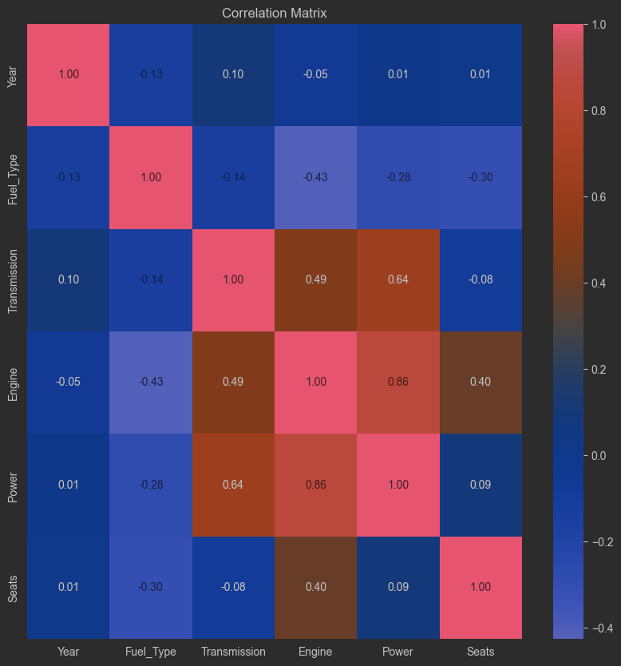
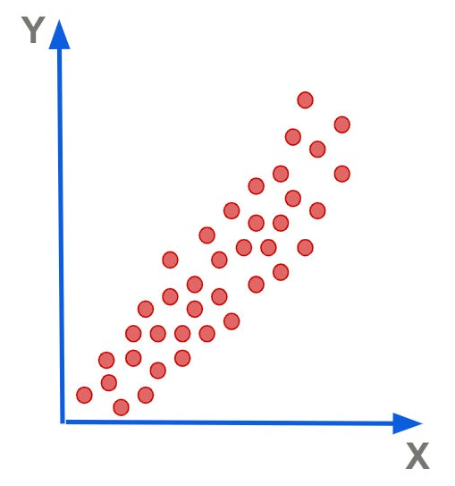
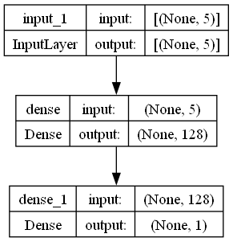
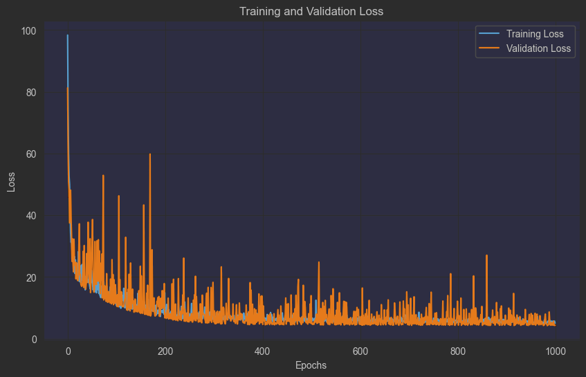

# Laporan Proyek Machine Learning - Nama Anda

## Domain Proyek

### Latar belakang

Untuk memecahkan masalah prediksi konsumsi BBM pada kendaraan dengan mesin pembakaran dalam (ICE), solusi deep learning
dapat dirancang sebagai berikut.

Pengumpulan dan pemrosesan data adalah langkah pertama yang perlu dilakukan. Data yang diperlukan mencakup fitur-fitur
kendaraan seperti ukuran mesin, bobot kendaraan, jumlah kursi, jenis transmisi, jenis bahan bakar, kapasitas mesin, dan
output daya mesin. Data ini bisa diperoleh dari spesifikasi kendaraan atau database otomotif. Setelah data terkumpul,
perlu dilakukan pemrosesan seperti mengatasi nilai yang hilang, mengubah data kategorikal menjadi bentuk numerik
menggunakan teknik seperti one-hot encoding, dan normalisasi atau standarisasi fitur numerik agar model dapat berlatih
dengan lebih efektif.

Selanjutnya, kita perlu merancang arsitektur model deep learning yang sesuai. Model akan menerima input berupa vektor
yang mewakili fitur-fitur kendaraan melalui lapisan input. Beberapa lapisan tersembunyi dengan jumlah neuron yang
berbeda bisa digunakan untuk menangkap pola kompleks antara fitur-fitur yang mempengaruhi konsumsi BBM. Pada lapisan
output, model akan menghasilkan satu output, yaitu prediksi konsumsi BBM.

Untuk melatih model, digunakan fungsi loss _mean squared error_ (MSE) untuk meminimalkan perbedaan antara prediksi model
dan nilai konsumsi BBM yang sebenarnya, serta metrik _mean absolute percentage error_ (MAPE) untuk mengukur kesalahan
prediksi dalam bentuk persentase. Data harus dibagi menjadi data latih dan validasi untuk mengevaluasi performa model
pada data yang tidak terlihat selama pelatihan.

Setelah model dilatih dan divalidasi dengan baik, model dapat diterapkan dalam sistem yang dapat memprediksi konsumsi
BBM secara real-time berdasarkan input spesifikasi kendaraan. Model ini dapat digunakan oleh pabrikan mobil untuk
merancang kendaraan ICE yang lebih efisien dan hemat bahan bakar, serta oleh konsumen untuk memilih kendaraan
berdasarkan efisiensi bahan bakar.

## Business Understanding

### Problem Statements

Berdasarkan latar belakang yang sudah di jabarkan, maka berikut ini adalah beberapa batasan masalah yang dapat
dituntaskan pada projek kali ini

1. Bagaimana membuat sistem yang dapat memprediksi konsumsi bahan bakar minyak?
2. Apakah hasil yang di berikan sistem ini memiliki ke-akuratan yang baik untuk di gunakan oleh konsumen?

### Goals

1. Membangun Sistem Deep Learning untuk Prediksi Konsumsi BBM
2. Evaluasi Akurasi Model

### Solution Statements

Solusi yang dapat diberikan adalah sebagai berikut:

- Membuat model Regresi menggunakan Neural Network.
- Menggunakan metrik MSE dan RMSE sebagai acuan.

## _Data Understanding_

Dataset yang digunakan pada projek ini dapat diakses menggunakan [kaggle](https://kaggle.com).<br>
informasi yang didapat oleh penulis dirangkum sebagaimana pada table 1

Table 1. Rangkuman Informasi Dataset

| Jenis         | Keterangan                                                                                    |
|---------------|-----------------------------------------------------------------------------------------------|
| Sumber        | [Kaggle Dataset : Cars Dataset](https://www.kaggle.com/datasets/ayushparwal2026/cars-dataset) |
| Lisensi       | [CC0 Public Domain](https://creativecommons.org/publicdomain/zero/1.0)                        |
| Kategori      | Automobiles, Cars                                                                             |
| Jenis File    | Comma Separated Value, CSV                                                                    |
| Ukuran Berkas | 785.45Kb                                                                                      |

<hr>
Berkas yang di unduh dari platform kaggle dalam format .csv dan hanya ada 1 berkas. Berkas tersebut memiliki 14 kolom dan 7252 baris data. Data tersebut mengandung data mobil yang pernah digunakan sebelumnya. untuk penjelasa terkati kolom pada data, penulis menjabarkan sebagai berikut :

- S.No : _Sequences Number_ atau nomor urut
- Name : Nama Mobil, contoh nya; Audi A4 New 2.0 TDI Multitronic
- Location : Lokasi kota mobil tersebut
- Year : Tahun produksi Mobil
- Kilometers Driven : Kilometer yang sudah di tempuh oleh mobil
- Fuel Type : Jenis bahan bakar; Bensin, diesel, CNG, LPG, EV.
- Transmission : Jensi transmisi; matic / manual
- Owner type : Tangan ke?; tangan pertama atau tangan kedua.
- Mileage : Konsumsi bahan bakar
- Enging : Ukuran kapasitas mesin (CC)
- seats : Jumlah kursi
- New Price : Harga baru(Saat pertama rilis)
- Price : Harga sekarang(current)

### Langkah-langkah persiapan data

1. Mengunduh _dataset_ dari [kaggle.com](https://kaggle.com)
2. Membaca _dataset_ yang telah di unduh dengan menggunakan _library Pandas_.
3. Menampilkan informasi dari _dataset_.
4. Menentukan kolom yang akan di gunakan sebagai fitur.
5. Menampilkan korelasi antar fitur

Berdasarkan langkah-langkah yang sudah penulis buat di atas, maka beberapa informasi yang dapat disampaikan dapat di
jelaskan pada beberapa tabel berikut.

Table 1. 5 entri pertama di kolom yang di tentukan

| # | Year | Fuel_Type | Transmission | Mileage    | Engine  | Power     | Seats |
|---|------|-----------|--------------|------------|---------|-----------|-------|
| 1 | 2015 | Diesel    | Manual       | 19.67 kmpl | 1582 CC | 126.2 bhp | 5.0   |
| 2 | 2011 | Petrol    | Manual       | 18.2 kmpl  | 1199 CC | 88.7 bhp  | 5.0   |
| 3 | 2012 | Diesel    | Manual       | 20.77 kmpl | 1248 CC | 88.76 bhp | 7.0   |
| 4 | 2013 | Diesel    | Automatic    | 15.2 kmpl  | 1968 CC | 140.8 bhp | 5.0   |
| 5 | 2013 | Diesel    | Manual       | 23.08 kmpl | 1461 CC | 63.1 bhp  | 5.0   |

Dari output kolom data yang sudah di tentukan penulis mengetahui bahwa ada 2 kolom yang bertipe kategorikal, yaitu
transmisi dan Fuel_Type. Untuk kolom engine, power, mileage seharusnya berupa numerik namun untuk dapat memudahkan
memahami data kolom tersebut masih ada character didalamnya. Setelah ini kita memerlukan pembersihan dan mapping pada
poin di bawah ini.

1. Jadikan numerik untuk tipe bahan bakar dan transmisi,
2. Hapus `char` yang ada pada Engine, Mileage, dan Power.

```text
<class 'pandas.core.frame.DataFrame'>
RangeIndex: 7253 entries, 0 to 7252
Data columns (total 14 columns):
 #   Column             Non-Null Count  Dtype  
---  ------             --------------  -----  
 0   S.No.              7253 non-null   int64  
 1   Name               7253 non-null   object 
 2   Location           7253 non-null   object 
 3   Year               7253 non-null   int64  
 4   Kilometers_Driven  7253 non-null   int64  
 5   Fuel_Type          7253 non-null   object 
 6   Transmission       7253 non-null   object 
 7   Owner_Type         7253 non-null   object 
 8   Mileage            7251 non-null   object 
 9   Engine             7207 non-null   object 
 10  Power              7207 non-null   object 
 11  Seats              7200 non-null   float64
 12  New_Price          1006 non-null   object 
 13  Price              6019 non-null   float64
dtypes: float64(2), int64(3), object(9)
memory usage: 793.4+ KB
```

teks diatas adalah informasi dataset, total ada 7253 data, namun terjadi reduksi data yang digunakan, di karena ada
_missing value_, 0 pada kolom, null pada kolom dan lain-lain, untuk pembahasan lebih lanjut dari masalah ini akan di
bahas pada bab [data preparation](#_data-preparation_)

Selanjutnya penulis memilih kolom atau fitur yang akan digunakan sebagai variable perhitungan pada sistem prediksi
konsumsi bahan bakar, Dalam dunia nyata hal-hal yang dapat mempengaruhi konsumsi bahan bakar ialah bobot, gaya
mengemudi, ukuran mesin, hambatan udara, daya mesin, usia kendaraan, tipe mesin(bensin / diesel), perseneling atau
transmisi. Beberapa faktor yang sudah di sebuthkan ini tidak semua ada pada data. Pada data yang kita miliki faktor
konsumsi BBM dapat di tentukan oleh, Engine(ukuran kapasitas mesin), Power(Output daya mesin), Year(tahun rilis), Seats(
jumlah bangku, mewakili bobot mobil), Transmission(perseneling manual / matic) dan Fuel_type(Tipe bbm yang digunakan).

Sebelum menampilkan korelasi antara fitur, kita diharuskan memiliki data dalam format numerik untuk keseluruhan kolom,
namun pada sub-bab ini preprocessing yang dilakukan tidak akan dibahas, untuk penjelasan terkait dengan preprocessing
ada pada [Data Preparation](#_data-preparation_). Maka dari itu penulis akan menyampaikan secara langsung korelasi antar
fitur yang ada tanpa label. Grafik dapat dilihat pada gambar 3.

<div align="center">

Gambar 3. Plot korelasi antar fitur.



</div>

Untuk menentukan korelasi yang baik adalah mendekati 1 atau mendekati -1, atau bisa juga di katakan menjauh dari 0.
Karena apabila korelasi antara fitur mendekati 0 maka fitur tersebut tidak memiliki pengaruh yang kuat dengan fitur
lainnya, alias variable lemah. Pada kesempatan ini penulis menemukan bahwa variable Year/Tahun tidak memiliki pengaruh
yang kuat dengan variable-variable lainnya, sehingga setelah ini variable Year/Tahun tidak akan digunakan dalam sistem
prediksi konsumsi bahan bakar.

## _Data Preparation_

### Tahapan _Data Preprocessing_

1. Melakukan pengecekan terhadap missing value
2. Melakukan Mapping dan menghapus `char` pada kolom tertentu.
3. Mengurutkan data
4. Pengecekan ulang terhadap data
5. Splitting Data

#### 1. Melakukan pengecekan terhadap missing value

Tahapan yang paling awal yang dilakukan oleh penulis dalam data preprocessing, pada tahapan ini penulis menggunakan
method `.dropna()` untuk menghilangkan baris data yang memiliki kekosongan pada salah satu kolomnya.
namun sebelum itu, penulis melakukan pengecekan untuk mengetahui jumlah banykanya _missing value_ pada data ini dengan
menggunakan method `.isna().sum()`, hasil dapat dilihat seperti pada tabel 2 berikut.

Tabel 2. Hasil dari `isna().sum()`

|              |    |
|--------------|----|
| Fuel_Type    | 0  |
| Transmission | 0  |
| Mileage      | 0  |
| Engine       | 46 |
| Power        | 46 |
| Seats        | 53 |

setelah itu melakukan dropping missing value dan menampilkan keseluruahan total data setelah di drop dengan potongan
kode berikut :

```python
df = df.dropna()
df.count()
```

kode diatas menghasilkan output seperti pada table 3 berikut.

Table 3. Output `.drop()` dan `.count()`

|              |      |
|--------------|------|
| Fuel_Type    | 7124 |
| Transmission | 7124 |
| Mileage      | 7124 |
| Engine       | 7124 |
| Power        | 7124 |
| Seats        | 7124 |

#### 2. Melakukan Mapping dan menghapus `char` pada kolom tertentu.

Hal Pertama disini adalah membuat mapping untuk tipe bahan bakar dan tipe transmisi serta membuat extractor untuk
menghilangkan text dan menyiskan angka pada kolom. Untuk mapping diberikan kondisi apabila

- 1 untuk bensin dan 0 untuk diesel
- 1 untuk transmisi otomatis dan 0 untuk manual
- gunakan regular expression dengan method `.extract()` dari `str()` dan cast menjadi numpy float.

Maka kode untuk mapping dan extractor adalah

```python
import numpy as np

# mapping
fuel_map = lambda x: 1 if x.lower() == 'petrol' else 0
trans_map = lambda x: 1 if x.lower() == 'automatic' else 0

# extractor 
ext = lambda x: x.replace('null bhp', np.NaN).str.replace(r'[^0-9.]', '', regex=True).astype(np.float64)
```

Selanjutnya hanya perlu menggunakan _method_ dari DataFrame yaitu `.map()` untuk mapping dan `.apply()` untuk extractor
seperti pada potongan kode di bawah ini.

```python
df.Fuel_Type = df.Fuel_Type.map(fuel_map)
df.Transmission = df.Transmission.map(trans_map)
df[['Engine', 'Mileage', 'Power']] = df[['Engine', 'Mileage', 'Power']].apply(ext)
df.head()
```

Dengan memanggil df.head() maka akan menampilkan 5 entri pertama setelah data di _preprocessing_, untuk hasil dapat
dilihat pada table 4 berikut.

Table 4. Hasil dari _Data Preprocessing_

| # | Fuel_Type | Transmission | Mileage   | Engine | Power     | Seats |
|---|-----------|--------------|-----------|--------|-----------|-------|
| 1 | 0         | 0            | 19.671875 | 1582.0 | 126.18750 | 5.0   |
| 2 | 1         | 0            | 18.203125 | 1199.0 | 88.68750  | 5.0   |
| 3 | 0         | 0            | 20.765625 | 1248.0 | 88.75000  | 7.0   |
| 4 | 0         | 1            | 15.203125 | 1968.0 | 140.75000 | 5.0   |
| 6 | 0         | 0            | 23.078125 | 1461.0 | 63.09375  | 5.0   |

#### 3. Mengurutkan data

Pada tahapan ini penulis mengurutkan data berdasarkan `Mileage`, penulis memilih mengurutkan data secara _ascending_, (
a-to-z), hal ini ditujukan agar dapat grafix seperti pada gambar 4, asumsikan x adalah jangkauan dari 0 hingga max 7124

<div align="center">

Gambar 4. Ilustrasi Sebaran Data


</div>

Secara pembacaan data, apabila di urutkan secara ascending maka, di urutkan berdasarkan kendaraan yang paling boros
dalam konsumsi bahan bakar, semisal angka terkecil adalah 3, maka itu berarti 3 kmpl(Kilometer per Liter).

Untuk melakukan sorting dapat dilihat pada potongan kode berikut serta contoh output pada table 5.

```python
sorted_data = df.sort_values(by='Mileage', ascending=True)
sorted_data.head(10)
```

Table 5. Hasil _Sorting_ berdasarkan `Mileage`

| #    | Fuel_Type | Transmission | Mileage | Engine | Power   | Seats |
|------|-----------|--------------|---------|--------|---------|-------|
| 5647 | 0         | 0            | 0.0     | 2446.0 | NaN     | 8.0   |
| 3210 | 0         | 1            | 0.0     | 2988.0 | 165.000 | 5.0   |
| 962  | 0         | 1            | 0.0     | 1950.0 | 194.000 | 5.0   |
| 2267 | 0         | 0            | 0.0     | 2446.0 | NaN     | 10.0  |
| 996  | 1         | 0            | 0.0     | 1086.0 | 62.000  | 5.0   |
| 3271 | 1         | 0            | 0.0     | 1086.0 | 62.000  | 5.0   |
| 6090 | 1         | 0            | 0.0     | 1086.0 | 62.000  | 5.0   |
| 6011 | 1         | 1            | 0.0     | 3596.0 | 262.500 | 5.0   |
| 6093 | 1         | 0            | 0.0     | 1086.0 | NaN     | 5.0   |
| 544  | 1         | 1            | 0.0     | 1950.0 | 181.375 | 5.0   |

#### 4. Pengecekan ulang terhadap data

Setelah data diurutkan berdasarkan Mileage secara ascending, penulis menemukan bahwa terdapat nilai NaN pada
kolom `Power` dan nilai 0 pada kolom `Mileage`. Nilai 0 pada Mileage tidak relevan karena konsumsi bahan bakar tidak
mungkin sama dengan 0, sementara nilai NaN pada kolom `Power` tidak bisa digunakan dalam perhitungan dan tidak dapat
digantikan dengan 0. Oleh karena itu, data yang mengandung nilai tersebut perlu dihapus. Dalam pengecekan data, hasilnya
menunjukkan bahwa kolom `Power` memiliki 124 nilai NaN, sementara kolom `Mileage` tidak memiliki nilai yang hilang,
tetapi mengandung nilai 0.

Penulis menemukan 124 data NaN (Not a Number) di dalam kolom `Power`, tidak hanya itu penulis juga mencari tahu berapa
banyak angka 0 pada kolom `Mileage`, hasilnya ada 67 data yang memiliki nilai 0, maka dari itu data tersebut harus di
drop lagi yang membuat data ini tereduksi cukup banyak yang menyisakan 6966 entri.

#### 5. Splittin Data

Tahapan ini bertujuan untuk membagi data menjadi 2 seksi, satu akan digunakan untuk pelatihan dan 1 lainnya akan
digunakan sebagai acuan untuk testing agar mendapatkan nilai evaluasi MSE dan MAPE. dari keseluruhan 6966 entri yang
digunakan, maka akan dibagi 80% data untuk pelatihan dan 20% untuk data uji. untuk pemabgian data sendiri di bantu
menggunakan _function_ `train_test_split` dari library scikit learn, disini penulis menetapkan bahwa data yang di-split
ini tidak di acak dengan mengirimkan parameter `shuffle=False`. Namun sebelum itu penulis memisahkan menjadi variable x
dan y untuk menyimapan data lable dan data fitur.

## Modeling

### _Deep Learning_

Deep Learning adalah teknik yang menginzinkan model komputasi yang terdiri dari banyak layer proses, layer ini akan
mempelajari representasi dari data dengan level abstraksi yang beragam. Deep Learning menemukan struktur yang menarik
dengan dataset yang besar dengan menggunakan algoritma backpropagation, algoritma ini untuk mengindikasi bagaimana mesin
harus mengganti parameter yang digunakan untuk menghitung tiap layer dari representasi layer sebelumnya[3].

#### Tahapan Umum Cara Kerja Deep Learning

Deep Learning adalah cabang dari machine learning yang menggunakan jaringan saraf tiruan dengan banyak lapisan (deep
neural networks) untuk menganalisis data dan membuat prediksi. Prosesnya dimulai dengan mengumpulkan data yang kemudian
diproses dan diubah menjadi format yang dapat diolah oleh model. Data ini kemudian diberikan ke jaringan saraf yang
terdiri dari lapisan-lapisan neuron, di mana setiap lapisan mengekstraksi fitur yang lebih kompleks dari data. Model ini
dilatih melalui proses backpropagation, di mana kesalahan prediksi dihitung dan digunakan untuk memperbarui bobot-bobot
jaringan. Melalui iterasi berulang dan penyesuaian parameter, model deep learning semakin mampu mengenali pola dan
membuat prediksi yang lebih akurat.

Pada kesempatan ini penulis menggunakan Linear Regression. Namun regresi linear yang ada tidak dapat belajar dengan
semestinya, untuk dapat menjelaskan bagaimana kerja dari regresi linear pada umumnya seperti pada gambar di bawah ini.

<div align="center">

Gambar 7. Contoh Regresi Linear

</div>

Penulis memanfaatkan Deep Learning agar model dapat melakukan pendekatan terhadap data latih yang di berikan. Dengan
melihat sebaran data maka dipilihlah Model deep learning, pada dasarnya deep learning juga menggunakan rumus yang sama
dengan regresi linear, persaman tersebut ada pada *Hidden layer* ialah <br>
$$ h = \sigma(Wx + b) $$

dengan ada nya epoch pada Deep learning maka model dapat menyesuaikan dengan latih berulang kali selama dalam proses
pelatihan. Berikut di bawah ini adalah gambar model FCNN untuk regresi.

<div align="center">

Gambar 9. Arsitektur Model FCNN(_Fully Connected Neural Network_)


</div>

### Model Hyperparameter

Table 6. Informasi _Hyperparameter Model_ FCNN.

| Layer | Layer Type | Information                           |
|-------|------------|---------------------------------------|
| 1     | Input      | Input : (None, 5), output : (None, 5) |
| 2     | FC(Dense)  | Neuron : 128, activation : relu       |
| 3     | Output     | Neuron : 4, activation : Softmax      |

Table 7. Informasi _Compiler Model_ FCNN

| Function  | Value                       |
|-----------|-----------------------------|
| Optimizer | Adam(learning_rate=default) |
| Loss Func | Mean Squared Error          |

## Evaluation

Pada proyek ini penulis menggunakan metrik _mean squared error_ dan _mean absolute percentage error_ sebagai metrik
evaluasi, _mean squared error_ atau bisa kita sebut dengan MSE sendiri adalah Rata-rata Kesalahan kuadrat antara nilai
aktual dan nilai peramalan. Metode Mean Squared Error secara umum digunakan untuk mengecek estimasi berapa nilai
kesalahan pada peramalan. Nilai Mean Squared Error yang rendah atau nilai mean squared error mendekati nol menunjukkan
bahwa hasil peramalan sesuai dengan data aktual dan bisa dijadikan untuk perhitungan peramalan di periode mendatang.
Metode Mean Squared Error biasanya digunakan untuk mengevaluasi metode pengukuran dengan model regresi atau model
peramalan seperti Moving Average, Weighted Moving Average dan Analisis Trendline. Cara menghitung Mean Squared Error (
MSE) adalah melakukan pengurangan nilai data aktual dengan data peramalan dan hasilnya dikuadratkan (squared) kemudian
dijumlahkan secara keseluruhan dan membaginya dengan banyaknya data yang ada[6]. sementara MAPE sendiri adalah
persentase kesalahan rata-rata secara mutlak (absolut). Pengertian Mean Absolute Percentage Error adalah Pengukuran
statistik tentang akurasi perkiraan (prediksi) pada metode peramalan. Pengukuran dengan menggunakan Mean Absolute
Percentage Error (MAPE) dapat digunakan oleh masyarakat luas karena MAPE mudah dipahami dan diterapkan dalam memprediksi
akurasi peramalan. Metode Mean Absolute Percentage Error (MAPE) memberikan informasi seberapa besar kesalahan peramalan
dibandingkan dengan nilai sebenarnya dari series tersebut. Semakin kecil nilai presentasi kesalahan (percentage error)
pada MAPE maka semakin akurat hasil peramalan tersebut. Beberapa analisa menyebutkan variasi nilai Mean Absolute
Percentage Error memiliki arti yang berbeda.

* Jika nilai MAPE kurang dari 10% maka kemampuan model peramalan sangat baik
* Jika nilai MAPE antara 10% - 20% maka kemampuan model peramalan baik
* Jika nilai MAPE kisaran 20% - 50% maka kemampuan model peramalan layak
* Jika nilai MAPE kisaran lebih dari 50% maka kemampuan model peramalan buruk

Dari nilai tersebut kita bisa memahami bahwa nilai MAPE masih bisa digunakan apabila tidak melebihi 50%. Ketika nilai
MAPE sudah diatas 50% maka model peramalan sudah tidak bisa digunakan lagi[6].

Rumus dari MSE dan MAPE dapat dilihat dari persaman berikut

$$ \text{MSE} = \frac{1}{n} \sum_{i=1}^{n} (y_i - \hat{y}_i)^2 $$

Di mana:

- \( y_i \) adalah nilai aktual
- \( \hat{y}_i \) adalah nilai prediksi
- \( n \) adalah jumlah data

$$ \text{MAPE} = \frac{1}{n} \sum_{i=1}^{n} \left| \frac{y_i - \hat{y}_i}{y_i} \right| \times 100\% $$

Di mana:

- \( y_i \) adalah nilai aktual
- \( \hat{y}_i \) adalah nilai prediksi
- \( n \) adalah jumlah data

Selama proses pelatihan model sebanyak 1000 epoch, loss berkurang hingga mendekati 0 seperti pada gambar 10 dibawah ini.

<div align="center">

Gambar 10. Plot hasil pelatihan model



</div>
Apabila kita lihat pada plot diatas, sekitar epoch ke 900-100 val_loss dan loss sudah bisa dikatakn baik, karena nilai 
dari val_loss sendiri sudah mendekati nilai loss.

maka hasil pada akurasi test berdasarkan MAPE dan MSE dapat di jelaskan pada kode berikut :

```python
def mean_squared_error(y_true, y_pred):
    return tf.reduce_mean(tf.square(y_true - y_pred)).numpy()


def mean_absolute_percentage_error(y_true, y_pred):
    if np.any(y_true == 0):
        raise ValueError("MAPE cannot be calculated when actual values contain zero.")

    absolute_percentage_errors = np.abs((y_true - y_pred) / y_true) * 100
    return np.mean(absolute_percentage_errors)


print(f"test MSE : {mean_squared_error(y_test, prediction)}")
print(f"test MAPE : {mean_absolute_percentage_error(y_test, prediction)}")
```

```text
test MSE : 4.443290080072254
test MAPE : 9.234500341497872
```

## Kesimpulan

Berdasarkan poin-poin yang sudah dibahas pada bab [Evaluasi](#evaluation), nilai MAPE yang berada di bawah 10%
menunjukkan kinerja model yang sangat baik dalam memprediksi data. Sementara itu, nilai MSE sebesar 4.443 masih
terbilang cukup besar, namun tetap dapat dianggap baik mengingat model prediksi ini menggunakan banyak variabel sebagai
fitur. Hal ini menunjukkan bahwa model memiliki kemampuan yang solid dalam menangani kompleksitas data, meskipun masih
ada ruang untuk peningkatan lebih lanjut dalam hal presisi prediksi.

Untuk menjawab Problem statement, tentu model Deep Learning yang dibuat sudah dapat diterapkan dan digunakan untuk umum,
model ini sendiri dapat di develop menggunakan web server via API atau bisa langsung di tanamkan bersamaan dengan
aplikasi mobile dengan format tflite. Namun tidak menutup kemungkinan bagi penulis dan peneliti lain untuk mengembangkan
model yang lebih baik sebagai acuan untuk memperhitungkan konsumsi bahan bakar kendaraan bermotor. Hal ini dapat
membantu masyarakat untuk dapat memilih kendaraan pribadi yang hemat BBM, terutama di berbagai kota besar di Indonesia
yang memiliki kondisi jalan yang ramai dan padat, tentu meningkatkan konsumsi BBM, hal ini dapat membantu untuk memilih
kendaraan yagn sesuai dengan keinginannya.

#### Referensi

1. [Datacard Cars Dataset](https://www.kaggle.com/datasets/ayushparwal2026/cars-dataset)
2. [Deep Learning: Cara Kerja, Kelebihan dan Penerapannya](https://itbox.id/blog/deep-learning-cara-kerja-kelebihan-dan-penerapannya/#cara_kerja_deep_learning)
3. [LeCun, Yann, et al. “Deep Learning.” Nature News, Nature Publishing Group, 27 May 2015, https://www.nature.com/articles/nature14539.](https://www.nature.com/articles/nature14539#citeas)
4. [Regresi Linear by UGM](https://metstat.mipa.ugm.ac.id/teori/regresi-linear/)
5. [MSE dan RMSE](https://medium.com/analytics-vidhya/mae-mse-rmse-coefficient-of-determination-adjusted-r-squared-which-metric-is-better-cd0326a5697e)


