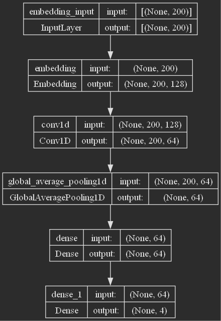
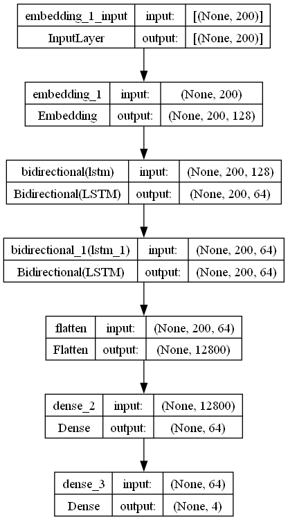
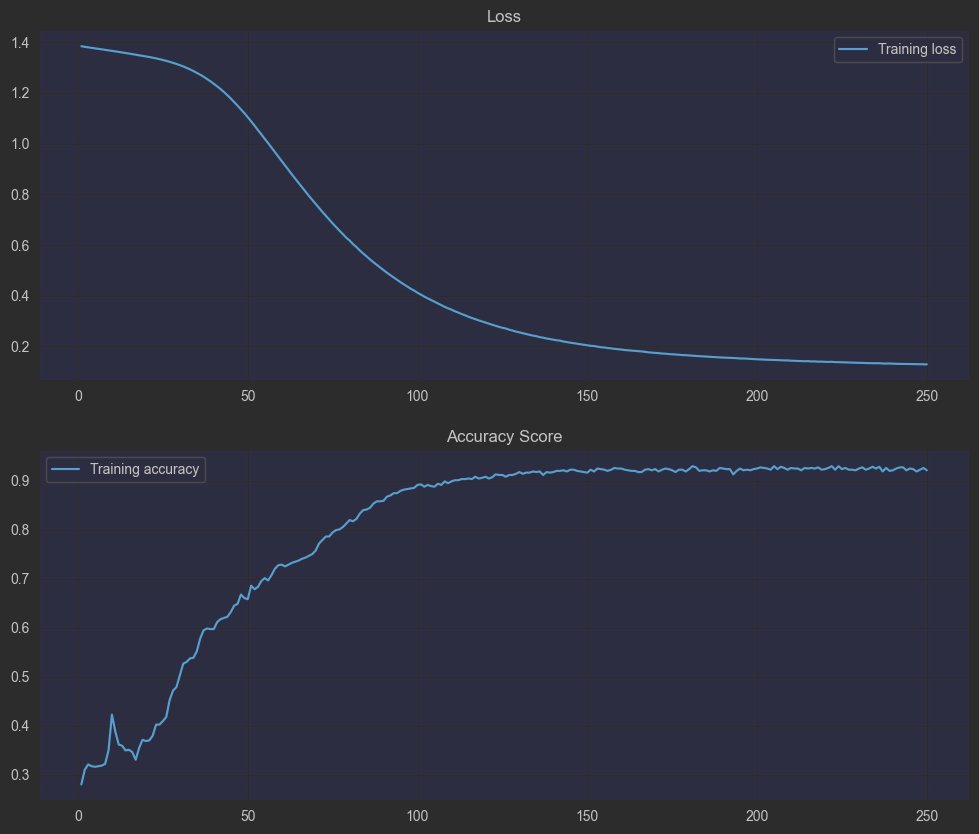
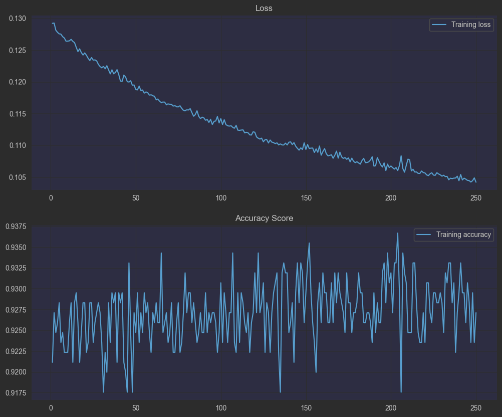
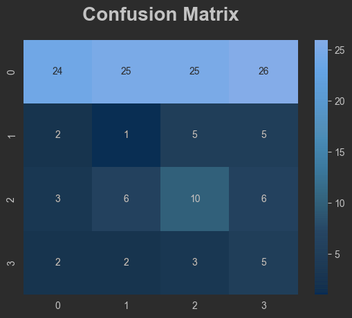
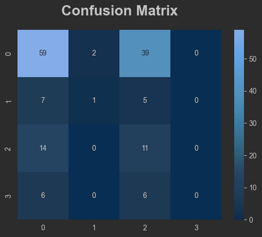

# Laporan Proyek Machine Learning - Nama Anda

## Domain Proyek

### Latar belakang

Puisi merupakan sebuah karya yang dapat menyampaikan sebuah pesan dan emosi tersirat dari penulis, namun banyak dari
masyarakat sulit memahami emosi atau pesan atau bahkan jenis dari puisi yang di sampaikan oleh penulis. Berdasarkan
beberapa artikel, berdasarkan data yang di dapat
ada 4 macam genre dalam sebuah puisi, yakni Kasih Sayang, Kematian, Musik, dan Lingkungan[1].

Dengan diberikannya beberapa indikator diatas, maka akan menjadi sebuah tantangan baru untuk menganalisa genre dari
sebuah puisi yang dapat di interpretasikan sebagai tugas
klasifikasi dimana tiap genre yang ada pada sebuah puisi. Analisa genre pada puisi ini berguna bagi orang awam dalam
memahami sebuah genre dan tujuan dari sebuah puisi yang di ciptakan.

Dalam kesempatan kali ini, analisis genre dapat dilakukan dengan melihat kata demi kata pada kalimat dan mencermati arti
dari kata, praktik ini cukup merepotkan dan memakan banyak waktu serta percobaan.
maka dibuat Dalam praktiknya, analisis genre pada puisi dapat dilakukan dengan mencermati setiap kata dan memahami
maknanya dalam konteks keseluruhan puisi.
Namun, proses ini cukup merepotkan dan memakan banyak waktu jika jumlah puisi yang dianalisis sangat banyak. Oleh karena
itu,
dibuatlah sebuah algoritma untuk memprediksi kategori genre dari puisi yang diberikan.
Algoritma ini dikembangkan dengan menggunakan <i>model Deep Learning</i> yang akan dilatih dan diuji dengan sejumlah
data teks puisi.

## Business Understanding

### Problem Statements

Berdasarkan latar belakang yang sudah di jabarkan, maka berikut ini adalah beberapa batasan masalah yang dapat
dituntaskan pada projek kali ini

1. Apakah model Deep Learning yang di kembangkan memiliki potensi untuk dapat digunakan dalam sektor pendidikan dan
   industri?
2. Apakah model Deep Learning yang di kembangkan bisa menjadi strategi pemasaran untuk menjangkau target pasar yang
   terdiri dari peneliti sastra?

### Goals

1. Mengembangkan Model Deep Learning yang dapat memiliki akurasi yang baik

### Solution Statements

Solusi yang dapat diberikan adalah sebagai berikut:

- Membuat model menggunakan Convolusi layer dan LSTM Layer
- Menggunakan Confusion Matrix sebagai acuan untuk membuat Classification Report.

## Data Understanding

Dataset yang digunakan pada projek ini dapat diakses menggunakan [kaggle](https://kaggle.com). 
informasi yang didapat oleh penulis dirangkum sebagaimana pada table 1

Table 1. Rangkuman Informasi Dataset

| Jenis         | Keterangan                                                                                                         |
|---------------|--------------------------------------------------------------------------------------------------------------------|
| Sumber        | [Kaggle Dataset : Poem Classification (NLP)](https://www.kaggle.com/datasets/ramjasmaurya/poem-classification-nlp) |
| Lisensi       | [CC0 Public Domain](https://creativecommons.org/publicdomain/zero/1.0)                                             |
| Kategori      | Social                                                                                                             |
| Jenis File    | Teks File, TXT                                                                                                     |
| Ukuran Berkas | 238.36 kB dan 43.14 kB                                                                                             |

Pada berkas yang di unduh dari platform kaggle, ada 2 berkas dengan jenis format .txt yang menjadi berkas untuk train dan test. 
Dengan total data yang ada di dalamnya 841 dan 150 data teks dan genre. Pada kedua berkas tersebut masing-masing memiliki 2 kolom yang bertipe kategorikal. 
Untuk penjelasan mengenai variable pada dataset sebagai berikut :

- <i>Poem</i> : Kalimat / Teks / Puisi yang di tulis.
- <i>Genre</i>  : Jenis atau genre dari puisi

### Langkah-langkah persiapan data

1. Mengunduh <i>dataset</i> dari [kaggle.com](https://kaggle.com)
2. Membaca <i>dataset</i> yang telah di unduh dengan menggunakan <i>library Pandas</i>.
3. Menampilkan informasi dari <i>dataset</i>.
4. Melakukan pengecekan dan menangani <i>missing value</i> (opsional).
5. Melakukan pengecekan <i>sample text</i> yang ada pada <i>DataFrame</i>.

#### 1. Mengunduh <i>dataset</i> dari [kaggle.com](https://kaggle.com)

Pada projek kali ini, dataset di unduh dari situs [kaggle.com](https://kaggle.com), untuk mengunduh data tersebut
diperlukan sebuah <i>libary</i> python bernama <i>opendatasets</i>,
selanjutnya <i>library</i> ini akan di <i>import</i> ke program python pada code cell dan di singkat menjadi. Kemudian
bisa kita lakukan pengunduhan menggunakan kode dengan memangil fungsi download pada library opendatasets dengan kode
``
od.download('https://www.kaggle.com/datasets/ramjasmaurya/poem-classification-nlp')
``. Setelah baris kode ini di run maka akan ada prompt yang meminta username dan kode sandi untuk login akun kaggle.

#### 2. Membaca <i>dataset</i> yang telah di unduh dengan menggunakan <i>library Pandas</i>.

Pada bagian ini penulis menggunakan fungsi ``pandas.read_csv`` untuk membaca berkas yang tersimpan pada komputer. Fungsi
tersebut digunakan untuk membaca berkas yang memiliki format .csv, file memiliki header dan pemisah antara kolom
adalah `","`.
Setelah berkas kedua berkas sudah dibaca dan disimpan ke variabel dengan nama **train** dan **test**. Berikut ini adalah
_sample text_ dari _data train_ dan _data test_ sebagaimana pada table 2.

Table 2. Contoh data pada _data train_

| # | Genre | Poem                                              |
|---|-------|---------------------------------------------------|
| 0 | Music | NaN                                               |
| 1 | Music |               In the thick brushthey spend the... |
| 2 | Music |    Storms are generous.                       ... |
| 3 | Music | —After Ana Mendieta Did you carry around the ...  |
| 4 | Music | for Aja Sherrard at 20The portent may itself ...  |

 

#### 3. Menampilkan informasi dari <i>dataset</i>.

Bagian ini akan menampilkan informasi dari _data train_ dan _data test_, untuk menampilkan informasi tersebut maka
digunakan fungsi dari library Pandas yaitu `.shape()` dan `.value_counts`
yang berguna untuk mengetahui jumlah data dan sebaran distribusi dari Genre pada Puisi. informasi lebih lanjut
dijabarkan pada table 3 sampai table 5 sebagai berikut.

Table 3. _Dataset Shape_

| DataFrame | Shape    |
|-----------|----------|
| train     | (841, 2) |
| test      | (150, 2) |

Tabel 4. Distribusi Genre pada **train**

| Genre       | Jumlah |
|-------------|--------|
| Music       | 239    |
| Death       | 234    |
| Environment | 227    |
| Affection   | 141    |

Table 5. Distribusi Genre pada **test**

| Genre       | Jumlah |
|-------------|--------|
| Music       | 100    |
| Death       | 25     |
| Environment | 13     |
| Affection   | 12     |

Maka total jumlah data dari dataset adalah 991 baris teks.

#### 4. Melakukan pengecekan dan menangani <i>missing value</i> (opsional).

Pada bagian ini diterapkan method ``.isnull().sum()`` untuk melakukan pengecekan apakah ada _missing value_ pada
dataset. Setelah di _run block code python_ pada program, ditemukan 4 _missing value_ pada **_data train_**.
  Setelah di ketahui ada missing value, maka penulis melakukan dropping baris menggunakan method ``.dropna()``, hal
ini mengakibatkan berkurangnya jumlah data yang tersimpan pada **_data train_**, untuk informasi jumlah data train dapat
di jabarkan pada table 6 dan 7 sebagai berikut.

Table 6. _Dataset Shape_

| DataFrame | Shape    |
|-----------|----------|
| train     | (837, 2) |
| test      | (150, 2) |

Table 7. Distribusi Genre pada **train**

| Genre       | Jumlah |
|-------------|--------|
| Music       | 238    |
| Death       | 231    |
| Environment | 227    |
| Affection   | 141    |

#### 5. Melakukan pengecekan <i>sample text</i> yang ada pada <i>DataFrame</i>.

pada bagian ini akan diambil satu _sample_ contoh, untuk melihat akan digunakan _index_ ke 0. Melihat _sample_ ini
berguna untuk mengecek apa saja yang perlu dilakukan pada tahap _data preparation_.
Berikut adalah contoh _sample_ dari tiap _DataFrame_:
> train sample txt: They all wore little hats Vermont that I Can see, the river its coronet Of yellow beetles—crawling,
> Flying—the flowers wearing The river for a hat. I can see thatWhen I stand alone Upon this acre as now Sober and
> living,
> the same, the same.They wore: Hats. They are not dead, John and Johnny and John, Which is a fine name for a
>
> test sample txt: In the middle garden is the secret wedding,that hides always under the other oneand under the shiny
> things of the other one. Under a treeone hand reaches through the grainy dusk toward another.Two right hands. The ring
> is a weed that will surely die.

## _Data Preparation_

### Tahapan _Data Preparation_

1. Menghapus angka
2. menghapus tanda baca
3. mengahapus blank space(&nbsp ;)
4. Merubah tiap kata di variabel text menjadi bentuk dasar
5. Merubah kata menjadi lowercase pada variabel text
6. Menghapus stopwords pada variabel text
7. Merubah variabel label menjadi numerik
8. One Hot Encoding label
9. Tokenisasi Teks

#### _Text Preprocessing_

Pada bagian ini, teks yang ada akan di process untuk menghapus, merubah dan lowercase, untuk melakukan itu digunakan
beberapa library yaitu `re`, `nltk` dan `pandas` Dibuat sebuah fungsi baru yang bernama `clean_text()` yang tugasnya
adalah
memanggil fungsi yang ada pada 3 library.

lowercase teks menggunakan pandas dengan menggunakan fungsi `.lower()`

Menghapus angka dan tanda baca menggunakan re atau regular expression, cara kerjanya adalah dengan mendefiniskan sebuah
pola yang akan dicek menggunakan regex jika ada maka akan dihapus.

Merubah kata menjadi bentuk dasar menggunakan ``nltk.stem.WordNetLemmatizer``, cara kerjanya adalah dengan mengecek
seluruh kata yang ada di teks, kemudian akan dibandingkan dengan _list_ yang ada di `WordNetLemmatizer` jika ditemukan
kata yang belum pada bentuk dasar maka akan dirubah dengan bentuk dasar.

Menghapus stopwords menggunakan ``nltk.corpus.stopwords``, cara kerjanya adalah dengan mengecek seluruh kata yang ada di
teks, kemudian akan dibandingkan dengan list yang ada di stopwords jika ditemukan kata pada teks yang ada di _list
stopwords_ maka akan dihapus.

Jika kita cek perubahan yang dilakukan dengan fungsi `.head()` maka hasilnya akan seperti Tabel 8.

Table 8.Tampilan _sample_ dari **_train_** setelah _text preprocessing_ dilakukan.

| # | Genre | Poem                                              | clean_text                                        | label |
|---|-------|---------------------------------------------------|---------------------------------------------------|-------|
| 1 | Music |               In the thick brushthey spend the... | thick brushthey spend hottest part day, soakin... | 3     |       
| 2 | Music | Storms are generous. ...                          | storms generous something easy surrender to, s... | 3     |
| 3 | Music | —After Ana Mendieta Did you carry around the ...  | ana mendieta carry around matin star hold fore... | 3     |
| 4 | Music | for Aja Sherrard at 20The portent may itself ...  | aja sherrard portent may memory wallace steven... | 3     |
| 5 | Music | for Bob Marley, Bavaria, November 1980 Here i...  | bob marley, bavaria, november brilliant mornin... | 3     |

 

#### Merubah label menjadi numerik

Pada bagian ini variabel label akan dirubah dari kategorikal menjadi numerik. Variabel label memiliki 4 kategori yaitu :
_Affection, Death, Environment, Music_. Kategori ini akan di ubah menjadi numerik (0-3) dengan
menggunakan `LabelEncoder()` dari _library_ Scikit-Learn yang di jelaskan pada table 9.

Table 9. Output dari `LabelEncoder()`

| Label       | Encoded |
|-------------|---------|
| Affection   | 0       |
| Death       | 1       |
| Environment | 2       |
| Music       | 3       |

#### _One Hot Encoding_

Pada bagian ini variabel label dari 1 kolom, yang berisi 6 kategori akan menjadi 6 kolom yang memiliki nilai 0 dan 1
saja. Dengan proses ini mesin dapat menebak kategori yang ada di dataset. Untuk melakukan _One Hot Encoding_
digunakan `to_categorical` dari _library_ `keras.utils`

#### Tokenisasi

Pada bagian ini akan digunakan `Tokenizer`, dan `pad_sequences` dari _library_ `tensorflow.keras`. Tujuan tokenisasi
adalah untuk membuat kamus yang berisi indeks dari teks yang berisi tiap kata dan merubah kata menjadi integer. Pertama
dimulai dnegan membuat kamus dari teks, teks yang akan digunakan hanya _DataFrame train_, penggunaan satu _DataFrame_
ini untuk mencegah agar mesin tidak seolah-olah mengetahui jawaban/kata yang ada di kamus saat dilakukan _test/val_
setelah dibuat kamus dengan `tokenizer.fit_on_texts(x_train)`, selanjutnya teks dari 3 DataFrame akan dirubah menjadi
integer perubahan ini dapat dilakukan dengan memanggil fungsi `tokenizer.texts_to_sequence(x_train)`
dan `tokenizer.texts_to_sequence(x_test)`.

Setelah teks di tokenisasi, teks di tiap DataFrame perlu kita pastikan memiliki panjang yang sama, untuk melakukan itu
digunakan fungsi `pad_sequences`  dari _library_ `tensorflow.keras`. teks dari 3 _DataFrame_ memiliki panjang 200, jika
teks melebihi dari 200 maka bagian belakang akan dihapus.

## Modeling

### _Deep Learning_

Deep Learning adalah teknik yang menginzinkan model komputasi yang terdiri dari banyak layer proses, layer ini akan
mempelajari representasi dari data dengan level abstraksi yang beragam. Deep Learning menemukan struktur yang menarik
dengan dataset yang besar dengan menggunakan algoritma backpropagation, algoritma ini untuk mengindikasi bagaimana mesin
harus mengganti parameter yang digunakan untuk menghitung tiap layer dari representasi layer sebelumnya[3].

#### Tahapan Umum Cara Kerja Deep Learning

Data akan masuk ke layer pertama, di mana setiap neuron akan memproses informasi yang diterima. Setiap neuron di layer
ini memiliki tugas khusus dalam memproses bagian tertentu dari data, misalnya dalam dataset yang digunakan, neuron
pertama mungkin akan mengenali sentimen anger. Informasi yang telah diproses oleh neuron ini kemudian akan disalurkan
melalui channel penghubung, namun sebelum itu, nilai weight dan bias akan dihitung dan diterapkan pada activation
function. Hasil dari activation function ini akan menentukan apakah neuron di layer berikutnya akan diaktifkan atau
tidak. Neuron-neuron yang diaktifkan akan meneruskan informasi ini ke layer berikutnya, dan proses ini berlanjut hingga
mencapai layer terakhir kedua. Pada layer ini, hanya satu neuron yang akan diaktifkan untuk menghasilkan keluaran atau
prediksi akhir.

Pada projek ini kasus yang di tangani oleh penulis adalah klasifikasi dan dataset dalam bentuk teks, jadi penulis
menggunakan _deep learning_ bertipe _1 Dimension Convolutional with Global Average Pooling_ dan 1 model lainnya bertipe
_Bidirectional Recurent Neural Network_ (BRNN) dengan memanfaatkan layer LSTM. Manfaat dari Model BRNN ini adalah model
dapat mempelajari dan menghafal ketergantugan pola jangka panjang, tipe ini dapat mengingat/menggunakan informasi di
layer. Yang membuat BRNN menarik adalah terdapat 2 RNN yang saling mengembalikan nilai yang ada pada dirinya. Keluaran
dari 2 RNN ini akan digabungkan tiap kali 1 perulangan. Tipe ini mengizinkan jaringan saraf tiruan untuk diberikan
informasi _backward_ dan _forward_ setiap perulangan. Untuk model yang menggunakan _Layer Convolution_ memanfaatkan
filter sebesar 64, kernal berukuran 5 dan _causal_ untuk _padding_. hal ini umumnya di terapkan pada data citra, namun
tetap dapat digunakan pada data teks karena data teks memiliki larik 1 dimensi. Arsitektur Model yang digunakan dapat
dilihat pada gambar berikut :

Gambar 1. Arsitektur _Model Convolutional_

Gambar 2. Arsitektur Model BRNN LSTM

### Model Hyperparameter

#### Model Convolutional

Table 10. Informasi _Hyperparameter Model Convolutional_

| Layer | Layer Type         | Information                                        |
|-------|--------------------|----------------------------------------------------|
| 1     | Input              | Input : (8465), output : (None, 200, 128)          |
| 2     | Conv1D             | Input : (None, 200, 128), output : (None, 200, 64) |
| 3     | Global Avg Pooling | Input : (None, 200, 64), output : (None, 64)       |
| 4     | FC(Dense)          | Neuron : 64                                        |
| 5     | Output             | Neuron : 4                                         |

Table 11. Informasi _Hyperparameter Model_ BRNN LSTM

| Layer | Layer Type | Information                                     |
|-------|------------|-------------------------------------------------|
| 1     | Input      | Input : (8465), output : (None, 200, 128)       |
| 2     | BRNN LSTM  | Neuron : 32, return_sequences = True            |
| 3     | BRNN LSTM  | Neuron : 32, return_sequences = True            |
| 4     | Flatten    | Input : (None, 200, 64), output : (None, 12800) |
| 5     | FC(Dense)  | Neuron : 64                                     |
| 6     | Output     | Neuron : 4                                      |

Table 12. Informasi _Compiler Model Convolutional_ dan Model BRNN LSTM

| Function  | Value                           |
|-----------|---------------------------------|
| Optimizer | Adam(learning_rate=0.0001)      |
| Loss Func | Sparse Categorical Crossentropy |
| Metrics   | Accuracy                        |

## Evaluation

Pada projek ini penulis menggunakan metode evaluasi _Confusion Matrix_ untuk mendapatkan _recall, precision_ dan
_accuracy_, untuk klasifikasi sendiri apabila angka akurasi mendekati 100% atau 1, maka dapat dikatakan performanya
baik, namun apabila nilai dari akurasi di bawah 75% atau 0.75, maka dapat dikatakan performa model itu buruk. Metrik
yang akan kita gunakan pada prediksi ini adalah _Accuracy_, metrik ini menghitung jumlah prediksi yang benar selisih
total prediksi yang dilakukan. _Accuracy_ didefinisikan dalam persamaan berikut:  
_Accuracy_ = $\frac{TP + TN}{TP + TN + FP + FN}$

Selain metrik accuracy akan digunakan _precision, recall_, dan _f1-score_ yang dibuat dengan
fungsi `classification_report()` yang disediakan oleh _library sklearn_.

Presisi digunakan untuk mengukur seberapa dapat diandalkan sebuah model ketika memberikan prediksi terhadap suatu
kelas/target. Presisi dapat didefinisikan sebagai berikut:  
Precision = $\frac{TP}{TP + FP}$

_Recall_ digunakan untuk mengukur kemampuan model untuk memprediksi kelas _True Positive_. _Recall_ dapat didefinisikan
sebagai berikut:  
_Recall_ = $\frac{TP}{TP + FN}$

_F1-Score_ digunakan untuk mencari titik seimbang antara Presisi dan _Recall_, _F1-Score_ didefinisikan sebagai
berikut:  
_f1-score_ = $\frac{2 * (precision * recall)}{precision + recall}$

dengan :

- TP : True Positive
- TN : True Negative
- FP : False Positive
- FN : Flase Negative

Gambar 3. Plot Akurasi dan Loss dari model _Convolutional_ 

Pada gambar di atas dapat dilihat bahwa hasil dari pelatihan model memberikan nilai akurasi akhir berada di atas 90% dan
_loss_ berada di bawah 20%, hal ini dapat di katakan model belajar dengan baik secara perlahan. Pada awal pelatihan, 
model memiliki _loss_ yang besar dan akurasi yang rendah namun seiring berjalannya _epoch_ hingga ke 200 model dapat 
memperbaiki performanya.   &nbsp;

Gambar 4. Plot

Gambar di atas adalah hasil pelatihan model bertipe BRRN yang memanfaatkan layer LSTM. Penulis dapat mengetahui bahwa
model BRNN ini memiliki akurasi dan _loss_ yang sangat baik di bandingkan dengan model _Convolutional_. Hal ini dapat
dilihat dari hasil pelatihan model yang tertera pada gambar di atas, dari epoch 1 hingga 250 nilai akurasi dari model
berkisar antara 90% sampai 94%, sementara untuk nilai _loss_ dari model selalu menurun di mulai dari 15% hingga sekitar
11%.

Lalu setelah kedua model di latih maka penulis selanjutnya melakukan evaluasi lanjutan menggunakan _Confusion Matrix_
dan _Classification Report_. Hasil dari _confusion matrix_ ini nantinya di gunakan sebagai referensi untuk melakukan
perhitungan pada _recall, precision_, dan _f1-score_. Detil lebih lanjut dari confusion matrix akan di jelaskan pada
gambar 5 dan 6, untuk detil dari `classification_report` akan di jelaskan pada table 10 dan 11 sebagai berikut.

Gambar 5. Hasil _Confusion Matrix_ model _Convolutional_

Plot confusion matrix diatas adalah hasil prediksi menggunakan model _Convolutional_. dimana kalau di lihat pada gambar
diatas, hasil dari performa model yang sudah dilatuh berbanding terbalik. atau biasa disebut dengan _overfitting_. dalam
confusion matrix, kolom adalah kelas aktual dan baris adalah kelas yang di prediksi. Maka untuk cara membacanya adalah
sebagai berikut :

1. Ada 24 data yang di prediksi sebagai kelas 0 sesuai dengan kelas aslinya.
2. Ada 25 data yang di prediksi sebagai kelas 0, namun kelas aslinya adalah kelas 1
3. Ada 25 data yang di prediksi sebagai kelas 0, namun kelas aslinya adalah kelas 2.
4. Ada 26 data yang di prediksi sebagai kelas 0, namun kelas aslinya adalah kelas 3.
5. Ada 2 data yang di prediksi sebagai kelas 1 , namun kelas aslinya adalah kelas 0.
6. Ada 1 data yang di prediksi sebagai kelas 1 sesuai dengan kelas aslinya.
7. Ada 5 data yang di prediksi sebagai kelas 1 , namun kelas aslinya adalah kelas 2.
8. Ada 5 data yang di prediksi sebagai kelas 1 , namun kelas aslinya adalah kelas 3.
9. Ada 3 data yang di prediksi sebagai kelas 2, namun kelas aslinya adalah kelas 0.
10. Ada 6 data yang di prediksi sebagai kelas 2, namun kelas aslinya adalah kelas 1.
11. Ada 10 data yang di prediksi sebagai kelas 2 sesuai dengan kelas aslinya.
12. Ada 6 data yang di prediksi sebagai kelas 2, namun kelas aslinya adalah kelas 3.
13. Ada 2 data yang di prediksi sebagai kelas 3, namun kelas aslinya adalah kelas 0.
14. Ada 2 data yang di prediksi sebagai kelas 3, namun kelas aslinya adalah kelas 1.
15. Ada 3 data yang di prediksi sebagai kelas 3, namun kelas aslinya adalah kelas 2.
16. Ada 5 data yang di prediksi sebagai kelas 3 sesuai dengan kelas aslinya.

Berdasarkan hasil dari confusion matrix tersebut maka dapat di simpulkan classification report pada table 10.

Table 13. _Classification Report_ model _Convolutional_

|              | precision | recall | f1-score | support |
|--------------|-----------|--------|----------|---------|
| Music        | 0.77      | 0.24   | 0.27     | 100     |
| Death        | 0.03      | 0.08   | 0.04     | 13      |
| Affection    | 0.23      | 0.40   | 0.29     | 25      |
| Environment  | 0.12      | 0.42   | 0.19     | 12      |
| &nbsp;       |           |        |          |         |
| accuracy     |           |        | 0.27     | 150     |
| macro avg    | 0.29      | 0.28   | 0.22     | 150     |
| weighted avg | 0.57      | 0.27   | 0.31     | 150     |

 
 

Gambar 6. _Confusion Matrix_ Model BRRN+LSTM

Dapat di simpulkan bahwa model _Convolutional_ dan BRRN+LSTM mengalami overfitting, overfitting sendiri adalah dalah
kondisi model
memberikan hasil prediksi dengan tingkat akurasi yang sangat tinggi namun hanya dalam dataset terkait saja. Umumnya
terjadi karena kekuarangan data hingga algoritma model yang tidak tepat (Firmansyach et al., 2023). Untuk membaca
confusion diatas adalah sebagai berikut :

1. Ada 59 data yang di prediksi sebagai kelas 0 sesuai dengan kelas aslinya.
2. Ada 2 data yang di prediksi sebagai kelas 0, namun kelas aslinya adalah kelas 1
3. Ada 39 data yang di prediksi sebagai kelas 0, namun kelas aslinya adalah kelas 2.
4. Ada 0 data yang di prediksi sebagai kelas 0, namun kelas aslinya adalah kelas 3.
5. Ada 7 data yang di prediksi sebagai kelas 1 , namun kelas aslinya adalah kelas 0.
6. Ada 1 data yang di prediksi sebagai kelas 1 sesuai dengan kelas aslinya.
7. Ada 5 data yang di prediksi sebagai kelas 1 , namun kelas aslinya adalah kelas 2.
8. Ada 0 data yang di prediksi sebagai kelas 1 , namun kelas aslinya adalah kelas 3.
9. Ada 14 data yang di prediksi sebagai kelas 2, namun kelas aslinya adalah kelas 0.
10. Ada 0 data yang di prediksi sebagai kelas 2, namun kelas aslinya adalah kelas 1.
11. Ada 11 data yang di prediksi sebagai kelas 2 sesuai dengan kelas aslinya.
12. Ada 0 data yang di prediksi sebagai kelas 2, namun kelas aslinya adalah kelas 3.
13. Ada 6 data yang di prediksi sebagai kelas 3, namun kelas aslinya adalah kelas 0.
14. Ada 0 data yang di prediksi sebagai kelas 3, namun kelas aslinya adalah kelas 1.
15. Ada 6 data yang di prediksi sebagai kelas 3, namun kelas aslinya adalah kelas 2.
16. Ada 0 data yang di prediksi sebagai kelas 3 sesuai dengan kelas aslinya.

Berdasarkan hasil dari confusion matrix tersebut maka dapat di simpulkan classification report pada table 11.

Tabel 14. _Classification Report_ model BRNN LSTM

|              | precision | recall | f1-score | support |
|--------------|-----------|--------|----------|---------|
| Music        | 0.69      | 0.59   | 0.63     | 100     |
| Death        | 0.33      | 0.08   | 0.12     | 13      |
| Affection    | 0.18      | 0.44   | 0.26     | 25      |
| Environment  | 0.00      | 0.00   | 0.00     | 12      |
| &nbsp;       |           |        |          |         |
| accuracy     |           |        | 0.47     | 150     |
| macro avg    | 0.30      | 0.28   | 0.25     | 150     |
| weighted avg | 0.52      | 0.47   | 0.48     | 150     |

 

## Kesimpulan

Kedua _model deep learning_ diatas mengalami _overfitting_, sederhananya _overfitting_ dapat di interpretasikan sebagai
seseorang yang rajin beljar dan nilai latihan selalu bagus, namun saat ia mengerjakan ujian, nilai nya justru tidak
bagus. Namun penulis mendapati bahwa nilai akurasi _test_ model _Convolutional_ adalah 27%, hal ini membuktikan model
_Convolutional_ dapat bekerja tidak sebaik model BRNN LSTM BRNN LSTM yang mampu mendapatkan akurasi _test_ sebesar 47%.
sebesar 11%.

Untuk saat ini dalam tahapan pengembangan, model ini tentu belum bisa menjangkau target pasar yang terdiri dari peneliti
sastra. Disamping hal itu, model yang di kembangkan ini memiliki potensi yang cukup dalam sektor pendidikan, karena
dalam kedepannya diharapkan ada penelitian yang berkaitan dengan menggunakan dataset puisi, sehingga dapat membantu
dalam sektor pendidikan.

#### Referensi

1. [Datacard Poem for NLP](https://www.kaggle.com/datasets/ramjasmaurya/poem-classification-nlp)
2. [Grefenstette, Gregory. “Tokenization.” Text, Speech and Language Technology, 1999, pp. 117–133., https://doi.org/10.1007/978-94-015-9273-4_9.](https://link.springer.com/chapter/10.1007/978-94-015-9273-4_9)
3. [LeCun, Yann, et al. “Deep Learning.” Nature News, Nature Publishing Group, 27 May 2015, https://www.nature.com/articles/nature14539.](https://www.nature.com/articles/nature14539#citeas)
4. [Analisa Terjadinya Overfitting Dan Underfitting Pada Algoritma Naive Bayes Dan Decision Tree Dengan Teknik Cross Validation](https://www.researchgate.net/publication/371396084_ANALISA_TERJADINYA_OVERFITTING_DAN_UNDERFITTING_PADA_ALGORITMA_NAIVE_BAYES_DAN_DECISION_TREE_DENGAN_TEKNIK_CROSS_VALIDATION)
5. [Overfitting dan Underfitting](https://dqlab.id/ragam-data-training-pada-tipe-machine-learning#:~:text=Underfitting%20merupakan%20kondisi%20saat%20nilai,nilai%20akurasi%20data%20testing%20rendah.)

